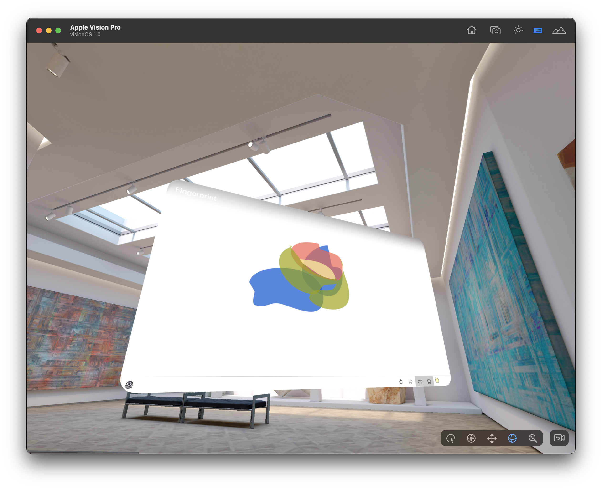

# visionos-fingerprint

Minimal VisionOS application to run the `fingerprint` drawing application.

## Description

This is the simplest and dumbest application to load the [aaronland/fingerprint](https://github.com/aaronland/fingerprint/) drawing application in a VisionOS window.

Because I do not have a Vision Pro device I can only test this in the simulator using the trackpad on a laptop to simulate hand/finger gestures. If you have a Vision Pro device and feel like testing this out I would love to hear how it works in "reality".

## Example

